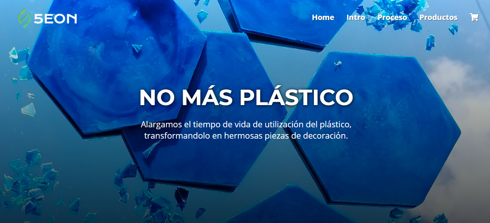

# app trivia
_proyecto desarrollado siguiendo como guia lineamientos presentados en el proyecto [trivia-laboratoria](https://github.com/Laboratoria/bootcamp/tree/main/projects/01-card-validation)_ 

## índice
* [1. Resumen del proyecto](#1-resumen-del-proyecto)
* [2. Objetivos de aprendizaje](#2-objetivos-de-aprendizaje)
* [3. Proceso creativo 🔧](#3-proceso-creativo)
* [4. Pre-requsitos 📋](#4-pre-requisitos)
* [5. Demo](#5-demo)
* [6. autores ✒️](#5-autores)


## 1. Resumen del proyecto
Laboratoria propone la siguiente descripcion de proyecto:

> ¿Qué tengo que hacer exactamente? En este proyecto tendrás que construir una aplicación web que le permita a un usuario validar el número de una tarjeta de crédito. Además, tendrás que implementar funcionalidad para ocultar todos los dígitos de una tarjeta menos los últimos cuatro.

> La temática es libre. Tú debes pensar en qué situaciones de la vida real se necesitaría validar una tarjeta de crédito y pensar en cómo debe ser esa experiencia de uso (qué pantallas, explicaciones, mensajes, colores, ¿marca?) etc..

El proyecto se abordo creando una SPA (Single page application) sin uso de ninguna libreria ni framework, la tematica abordada fue un emprendimiento que recicla y procesa el plastico:

>> produccion de productos como recipiezas, carcasas, murales...

## 2. Objetivos de aprendizaje

### UX

- [x] Diseñar la aplicación pensando y entendiendo al usuario.
- [x] Crear prototipos para obtener feedback e iterar.

### DOM

- [x] Uso de selectores del DOM.
- [x] Manejo de eventos del DOM.
- [x] Manipular dinámicamente el DOM.

### JavaScript

- [x] Creacion de una SPA JS-Vanilla.
- [x] Creaction de un router basado en hash JS-Vanilla.
- [x] Gestion de vistas basado en componentes JS-Vanilla.
- [x] Estructuracion y persistencia de datos basado en objetos JSON.
- [x] Gestion del localstorage.
- [x] Buenas prácticas de desarrollo.


## 3. Proceso creativo 🔧

### Prototipo baja fidelidad 📋

<table>
    <tr>
        <td></td>
    </tr>

</table>

### Prototipo final

<table>
    <tr>
        <td>Landing Page / Home</td>
        <td>Landing Page / Intro</td>
    </tr>
    <tr>
        <td></td>
        <td></td>
    </tr>
    <tr>
        <td>Landing Page / Proceso</td>
        <td>Landing Page / Productos</td>
    </tr>
    <tr>
        <td></td>
        <td></td>
    </tr>
 </table>


## 4. Pre-requisitos
_Necesario `npm`_

```
npm install -g sass
```


# 5. Demo 

* deploy del proyecto [DEPLOY](https://isabelajs.github.io/5EON/)


* repositorio del proyecto [REPO](https://github.com/isabelajs/5EON)
* Figma del proyecto [REPO](https://www.figma.com/file/fDLfcGee4FpbxD47yfnVPb/prototype?node-id=0%3A1)


# 6. Autores ✒️

_Proyecto desarrollado por:_

* **Juan Camilo ibañez** - *ingeniero industrial* - [proyectos](https://github.com/JuanC-JC)
* **Isabela Jimenez Salazar** - *ingeniera industrial* - [proyectos](https://github.com/isabelajs)